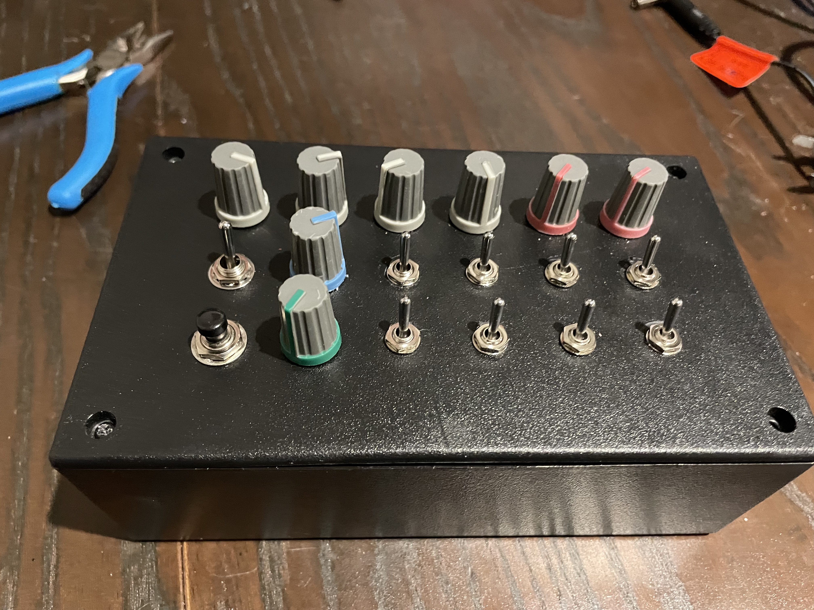

# HEXARCH

the HEXARCH is a modified [Cacophonator](https://theremin.us/Circuit_Library/cacophonator.html).

the design is more or less straightforward enough to make on the [Looney Board](https://fluxmonkey.com/pcbDocs/looney1.htm)

## REVISION I

4 oscilators, with selectable mute and resistive/diode mixing. 2 power fuckers, 1 voltage starver. volume control. on/off and pulse on. large capacitor provides current when switched off for... a bit 2200uF seems to be a minute or two.

2.1mm center negative 9V power, 6.5mm mono audio out.

first design uses a 74HC14, the original Cacophonator uses an older 40106.

see the [circuit](https://github.com/scoutquinn/circuit) folder for drawings of the design.

there's a demo on [twitter](https://twitter.com/pathofunction/status/1434861551324852231).

- [ ] REVISION I UPDATE: CHANGE CERTAIN CAPACITORS TO ELECTROLYTIC
- [ ] REVISION I UPDATE: SEE IF A 40106 SOUNDS DIFFERENT

## TODO

- [ ] fix leakage on oscilator mutes or remove them\*
- [ ] audio kill switch\*\*
- [ ] audio "cut up" momentary kill switch\*\*
- [ ] variable oscilator frequencies?
- [ ] change resistive/diode mixing to one switch for all 4 oscilators

\* _mute is currently on the "audio out" for each oscilator, potentially move the mute to the feedback resistor line (before the potentiometer)_
\*\* _would definite be easier to do this in a little external housing like a mini stomp box_

## CONTROLS

should be fairly self explanitory from the drawing, xandra figured it out before i labelled them all.

## REVISION II

revision ii should have everything in the TODO list, may need a bigger housing.
