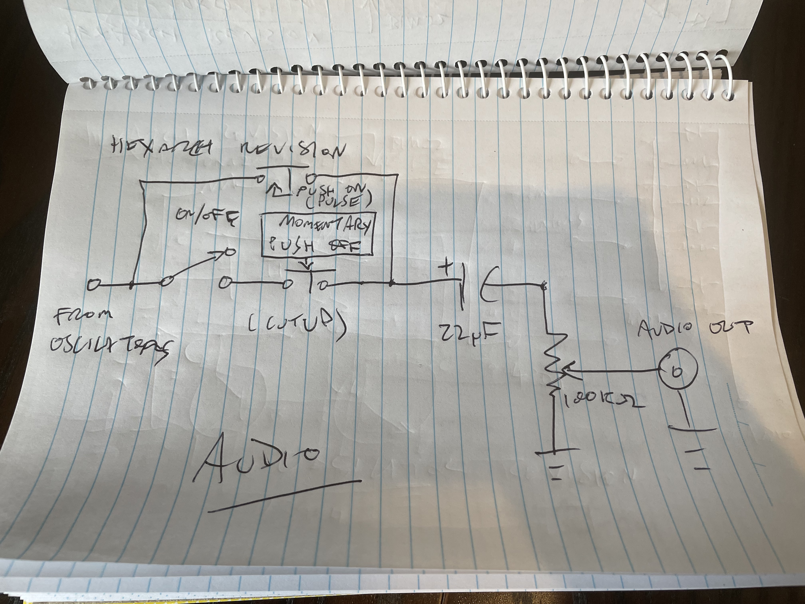
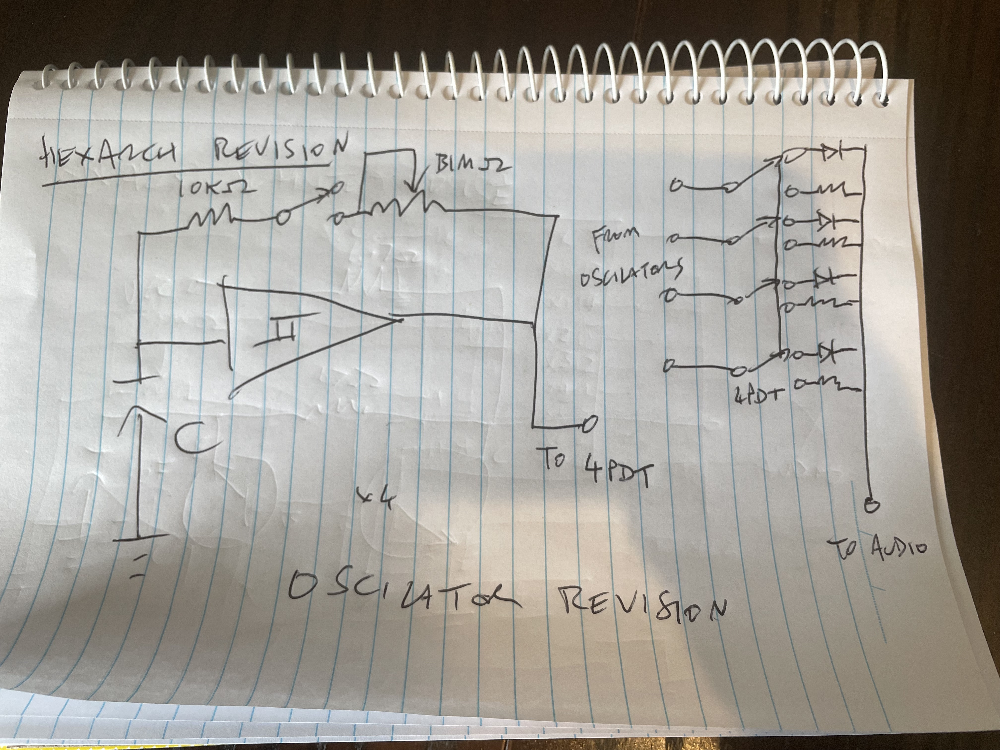
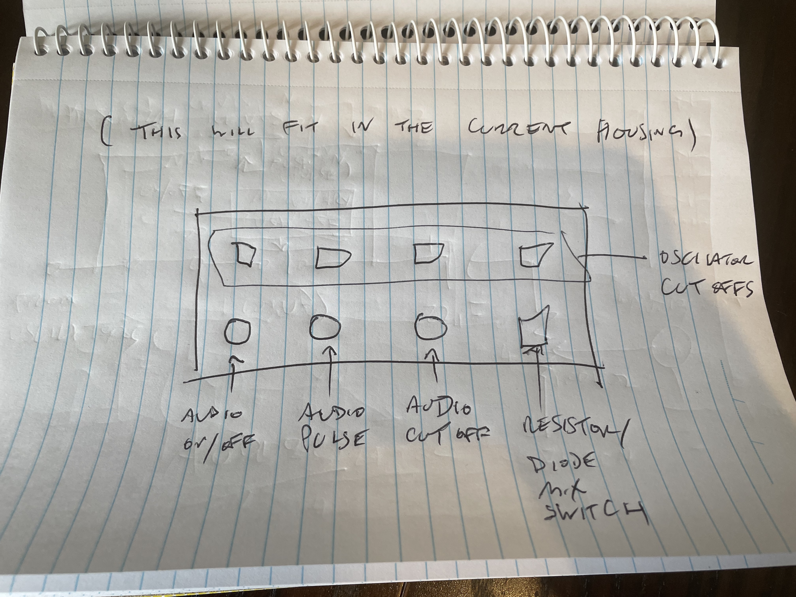

# REVISION II

***(i mostly did this completely differently but kinda like this)***

~~_this should all "fit" with some minimal work, and some rewiring/resoldering. I might also change some caps for electrolytic types while i'm in there._  ~~

~~_also need to consider the oscilator "mute"/cutoffs. where it is now (after the output) it kinda... leaks? which is kinda cool i guess. it impacts the sound. moving the switch to the wiring of the potentiometer on each oscilator **should** cut it off "cleanly" but do i actually want that? if i have it there and that does actually work i might want momentary buttons instead of switches._~~
